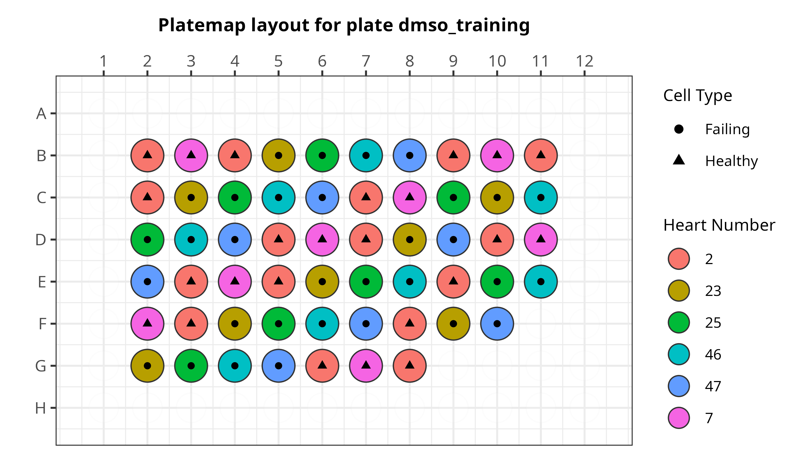

# Predicting heart failure etiology from cardiac fibroblasts

In this repository, we perform image analysis and image-based profiling on a plate with cardiac fibroblasts derived from six patients with or without heart failure.
We train three models, one for predicting heart failure status and two for predicting heart failure subtypes.

## Plate map details

There is one plate in this dataset.
Each well contains cardiac fibroblasts derived from either a heart from a patient with or without heart failure.
All patients are male and all heart failure patients had idiopathic dilated cardiomyopathy (IDC).
There are two hearts from patients without ICM and four patients that had IDC.
There are two subtypes of ICM, two patients with HCM and two patients with DCM.
All wells were treated with DMSO except for eight wells from heart #2 which had no treatment which we use for normalization.

For this dataset, the Cell Painting staining swaps the cytoplasmic RNA/nucleoli stain for a specific F-actin stain to image the following organelles (with mapping to respective channel):

- Nuclei (d4)
- Endoplasmic Reticulum (d3)
- Golgi/Plasma Membrane (d2)
- Mitochondria (d1)
- F-actin (d0)



> Plate map layout for the DMSO plate.

## Environments

We utilize environments defined in the [environments folder](./environments/).

1. [CellProfiler environment](./environments/cellprofiler_env.yml): This environment installs CellProfiler, which we use for the illumination correction and feature extraction modules.
2. [R environment](./environments/r_fibrosis_env.yml): This environment is specific to R, which we use for generating figures.
3. [Preprocessing environment](./environments/preprocessing_env.yml): This environment installs preprocessing softwares (pycytominer, CytoTable, coSMicQC) to format the morphological readouts as single-cell profiles.
4. [Machine learning environment](./environments/machine_learning_env.yml): This environment is used in the module for applying the pre-trained model on the data and evaluating the results for "hits" that could be reversing fibrosis.

These environments can be installed either via conda or mamba.
Below is an example of how to install via the terminal.

```bash
# Make sure to be in this repo as the current directory
mamba env create -f ...
```
